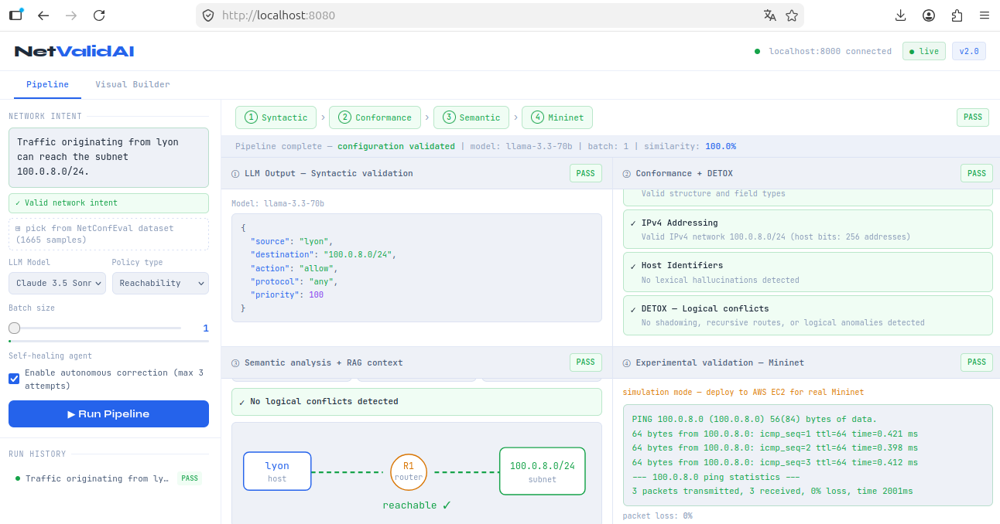

# NetValidAI — Framework para Verificação e Validação Experimental de Configurações de Rede Geradas por LLMs

Este repositório contém o artefato associado ao artigo **"Framework para Verificação e Validação Experimental de Configurações de Rede Geradas por LLMs"**, aceito na Trilha Principal do **SBRC 2026**.

> **Resumo:** A utilização de Modelos de Linguagem de Grande Porte (LLMs) na geração de configurações e validação de políticas de rede tem recebido atenção crescente na literatura. Diferente da abordagem predominante que prioriza a acurácia da geração, este trabalho direciona seus esforços para o processo de verificação, avaliando a estabilidade sob carga (batch size) e a complexidade das intenções traduzidas de linguagem natural para requisitos técnicos. O artigo apresenta três contribuições: a proposição de uma arquitetura multi-estágio que integra a detecção de inconsistências lógicas à saída dos LLMs; a identificação do limite de confiabilidade dos modelos em relação ao tamanho do lote de tarefas; e a demonstração de que a validade sintática é um indicador insuficiente para garantir a conectividade operacional em redes de computadores.

## Demo



---

# Estrutura do Repositório

```
llm-network-validation-framework/
├── api-gateway/          # FastAPI — orquestrador do pipeline (main.py, Dockerfile, requirements.txt)
├── verifier/             # Etapas 1–3: sintaxe (syntactic.py), conformidade (conformance.py), semântica (semantic.py)
├── rag-engine/           # Motor RAG sobre o dataset NetConfEval (engine.py)
├── self-healing-agent/   # Agente de autocorreção automática (agent.py)
├── mininet-runner/       # Etapa 4: emulação Mininet e teste de conectividade (orchestrator.py)
├── frontend/             # Interface web single-page (index.html)
├── scripts/              # Scripts de benchmark e reprodução dos experimentos (run_benchmark.py)
├── docs/                 # Documentação complementar e imagens
├── docker-compose.yml    # Orquestração completa dos serviços
├── .env.example          # Template de configuração de ambiente
└── README.md
```

---

# Selos Considerados

Os selos considerados são: **Disponível (SeloD)**, **Funcional (SeloF)** e **Sustentável (SeloS)**.

---

# Informações Básicas

## Ambiente de execução

| Componente | Versão mínima |
|---|---|
| Python | 3.10+ |
| Docker | 24.x |
| Docker Compose | 1.29+ |
| Sistema Operacional | Linux, macOS ou Windows (com WSL2) |
| RAM | 4 GB mínimo |
| Disco | 2 GB livres |

## Recursos de hardware utilizados nos experimentos do artigo

- CPU: Intel Xeon Gold
- RAM: 128 GB
- SO: Ubuntu 22.04

## Chaves de API necessárias (ao menos uma)

| Provedor | Modelos | Custo |
|---|---|---|
| Groq | Llama 3.3 70B, Mistral Large, DeepSeek, Qwen-3 | Gratuito |
| Anthropic | Claude 3.5 Sonnet | Pago |
| OpenAI | GPT-4, GPT-4 Turbo | Pago |

> **Recomendação para avaliadores**: use a chave Groq (gratuita) em https://console.groq.com

---

# Dependências

## Dependências Python (api-gateway/requirements.txt)

```
fastapi>=0.111.0
uvicorn[standard]>=0.29.0
pydantic>=2.7.0
httpx>=0.27.0
python-dotenv>=1.0.1
openai>=1.30.0
anthropic>=0.28.0
groq>=0.9.0
scikit-learn>=1.4.0
numpy>=1.26.0
```

## Dataset

O artefato utiliza o dataset **NetConfEval** [Dahlmann et al., ACM SIGCOMM CCR 2024] como ground truth para a Etapa 3 (verificação semântica via RAG). Um subconjunto de 20 amostras representativas está embutido diretamente no código (`rag-engine/engine.py`) para uso imediato sem necessidade de download externo.

---

# Preocupações com Segurança

- O arquivo `.env` contém chaves de API pessoais e **nunca deve ser compartilhado ou commitado**. O repositório inclui apenas o `.env.example` como template.
- A Etapa 4 (Mininet real) requer privilégios `sudo` no Linux. Em modo `simulated` (padrão no Docker), nenhum privilégio especial é necessário.
- Não há riscos à segurança dos avaliadores ao executar o artefato em modo simulado.

---

# Instalação

## Opção A — Docker Compose (recomendada para avaliadores)

```bash
# 1. Clonar o repositório
git clone https://github.com/cscolomboIA/llm-network-validation-framework.git
cd llm-network-validation-framework

# 2. Configurar o ambiente
cp .env.example .env
nano .env  # adicione ao menos uma chave de API (recomendamos GROQ_API_KEY)

# 3. Subir os serviços
docker-compose up --build
```

Aguarde até aparecer `api_1 | INFO: Application startup complete.`

- **Frontend**: http://localhost:8080
- **API**: http://localhost:8000

## Opção B — Instalação local (sem Docker)

```bash
git clone https://github.com/cscolomboIA/llm-network-validation-framework.git
cd llm-network-validation-framework

pip install -r api-gateway/requirements.txt

cp .env.example .env
nano .env  # adicione ao menos uma chave de API

# Terminal 1 — API
cd api-gateway
uvicorn main:app --host 0.0.0.0 --port 8000 --reload

# Terminal 2 — Frontend
cd frontend
python -m http.server 8080
```

---

# Teste Mínimo

Após a instalação, verifique se a API está respondendo:

```bash
curl http://localhost:8000/health
# Esperado: {"status": "ok", "version": "2.0.0"}
```

Acesse http://localhost:8080 e execute com o intent de exemplo:

```
Traffic originating from lyon can reach the subnet 100.0.8.0/24.
```

Configurações:
- Modelo: Llama 3.3 70B
- Policy type: Reachability
- Batch size: 1

**Resultado esperado**: todas as 4 etapas com status PASS e similaridade ~100%, conforme Tabela 2 do artigo.

Ou via API:

```bash
curl -X POST http://localhost:8000/api/pipeline/run \
  -H "Content-Type: application/json" \
  -d '{
    "intent": "Traffic originating from lyon can reach the subnet 100.0.8.0/24.",
    "model": "llama-3.3-70b",
    "policy_type": "reachability",
    "batch_size": 1
  }' | python3 -m json.tool
```

---

# Experimentos

## Reivindicação #1 — Ponto de inflexão crítico no batch size = 20

O artigo demonstra que a acurácia sintática dos LLMs degrada significativamente a partir de 20 tarefas simultâneas (Figura 2).

```bash
python scripts/run_benchmark.py \
  --models llama-3.3-70b \
  --policy_types reachability \
  --batch_sizes 1 3 5 9 20 33 50 100 \
  --samples_per_cell 5 \
  --output results/batch_stress.json
```

**Tempo estimado**: 15–30 minutos.
**Resultado esperado**: queda na acurácia sintática a partir do batch size 20.

## Reivindicação #2 — Validade sintática não garante corretude operacional

Execute o pipeline via interface web com diferentes batch sizes e observe a divergência entre o resultado da Etapa 1 (sintático) e da Etapa 4 (Mininet).

## Reivindicação #3 — Similaridade textual não prediz corretude funcional

```bash
python scripts/run_benchmark.py \
  --models llama-3.3-70b \
  --policy_types load-balancing \
  --batch_sizes 1 \
  --samples_per_cell 10 \
  --output results/similarity_vs_operational.json
```

Analise o campo `similarity_score` vs `4_mininet.status` nos resultados.

---

# LICENSE

MIT License — Copyright (c) 2026 Cristiano da Silveira Colombo, Magnos Martinello

## Contato

- Cristiano Colombo — cristianos@ifes.edu.br
- Magnos Martinello — magnos@inf.ufes.br
